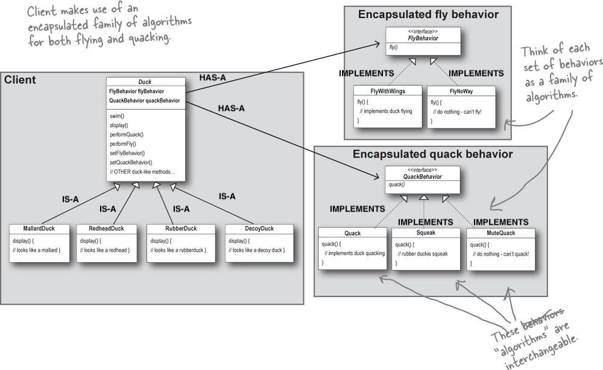
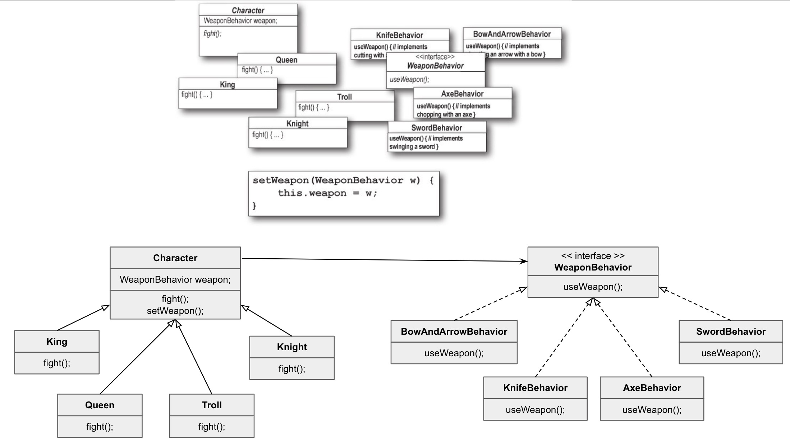

# Strategy Pattern
**Definition:** The *Strategy Pattern* defines a family of algorithms, encapsulates each one, and makes them interchangeable. Strategy lets the algorithm vary independently from clients that use it.

## The Big Picture on encapsulated behaviors

Write the appropriate relationship (IS-A, HAS-A, and IMPLEMENTS) on each arrow in the class diagram:

    

#### HAS-A can be better than IS-A
When you put two classes together like this, you're using **composition**. Instead of *inheriting* their behavior, the ducks get their behavior by being *composed* with the right behavior object.

## Design Principles
1. Identify the aspects of your application that vary and separate them from what stays the same.
    - Take the parts that vary and "encapsulate" them, so that later you can alter or extend the parts that vary without affecting those that don't. This will result in fewer unintended consequences from code changes and more flexibility in your systems.
2. Program to an interface/supertype, not an implementation
    - From now on, the Duck behaviors will live in a separate class - a class that implements a particular behavior interface. That way, the Duck classes won't need ot know any of the implementation details for their own behaviors.
3. Favor composition over inheritance
    - You can change behavior at runtime as long as the object you're composing with implements the correct behavior interface.

### The power of a shared pattern vocabulary
* When you communicate using patterns you are doing <ins>more</ins> than just sharing LINGO
    * Shared pattern vocabularies are POWERFUL
    * Patterns allow you to say more with less
    * Talking at the pattern level allows you to stay "in the design" longer
    * Shared vocabularies can turbo-charge your development team
    * Shared vocabularies encourage more junior developers to get up to speed

## Design Toolbox
* OO Basics
    * Abstraction
        * Abstraction is a process of hiding the implementation details from the user, only the functionality will be provided to the user. In other words, the user will have the information on what the object does instead of how it does it. In Java, abstraction is achieved using Abstract classes and interfaces.
    * Encapsulation
        * Encapsulation in Java is a mechanism of wrapping the data (variables) and code acting on the data (methods) together as a single unit. In encapsulation, the variables of a class will be hidden from other classes, and can be accessed only through the methods of their current class. Therefore, it is also known as data hiding. To achieve encapsulation in Java −
            * Declare the variables of a class as private.
            * Provide public setter and getter methods to modify and view the variables values.
    * Polymorphism
        * Polymorphism is the ability of an object to take on many forms. The most common use of polymorphism in OOP occurs when a parent class reference is used to refer to a child class object. Any Java object that can pass more than one *IS-A* test is considered to be polymorphic. 
    * Inheritance
        * Inheritance can be defined as the process where one class acquires the properties (methods and fields) of another. With the use of inheritance the information is made manageable in a hierarchical order. The class which inherits the properties of other is known as subclass (derived class, child class) and the class whose properties are inherited is known as superclass (base class, parent class).
        * **extends** is the keyword used to inherit the properties of a class. 
* OO Principles
    * Encapsulate what varies
    * Favor composition over inheritance
    * Program to interfaces, not implementations.
* OO Patterns
    * Strategy - defines a family of algorithms, encapsulates each one, and makes them interchangeable. Strategy lets the algorithm vary independently from clients that use it.

## Design Puzzle Solution

    

